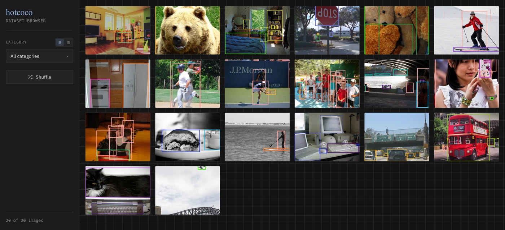

# Dataset browser

hotcoco ships a lightweight visual browser for COCO datasets — no FiftyOne, no heavy
dependencies. Two entry points:

- **`coco.browse()`** — launches inline in Jupyter; opens a local server otherwise
- **`coco explore`** — CLI subcommand for standalone use

Both require the `[browse]` optional extra:

```bash
pip install hotcoco[browse]
```

---

## Quick start

```python
from hotcoco import COCO

coco = COCO("instances_val2017.json", image_dir="/data/coco/val2017/")
coco.browse()
```

That's it. A local server starts and a browser tab opens.

<figure class="screenshot" markdown>

<figcaption>The grid view. Every thumbnail is drawn with its annotations overlaid, one
color per category, so you can scan a split for labeling problems without opening a
single image.</figcaption>
</figure>

The `coco explore` subcommand does the same from a shell — see
[CLI options](#cli-options).

---

## UI overview

A filter sidebar sits beside an infinite-scroll thumbnail grid; clicking any
thumbnail opens a lightbox with the full-resolution image, a canvas annotation
overlay, and an annotation list.

**Sidebar controls:**

| Control | What it does |
|---------|-------------|
| Category dropdown | Filter to images containing the selected categories (multi-select) |
| Min Score slider | Filter detections below a confidence threshold (when DT loaded) |
| Shuffle | Randomize the display order |
| N of M images | Live image count for the current filter |

**Thumbnail grid:**

- Annotated thumbnails with bounding boxes rendered server-side
- Infinite scroll — new batches load automatically as you scroll down
- Click any thumbnail to open the lightbox

**Lightbox:**

- Full-resolution image with a canvas overlay for annotations
- Hover any annotation to highlight it — the sidebar and canvas stay in sync
- Toggle layers (Boxes / Segments / Keypoints) and sources (GT / DT) instantly
- Scroll to zoom, drag to pan, double-click to reset
- Arrow keys navigate between images; Escape closes the lightbox

---

## Viewing detections

Pass detection results to `browse()` and hotcoco overlays your model's predictions
alongside ground truth:

```python
from hotcoco import COCO

coco = COCO("instances_val2017.json", image_dir="/data/coco/val2017/")

# Pass a path — auto-loaded via load_res()
coco.browse(dt="bbox_results.json")

# Or pass a COCO object you already have
results = coco.load_res("bbox_results.json")
coco.browse(dt=results)
```

From the command line:

```bash
coco explore \
    --gt instances_val2017.json \
    --images /data/coco/val2017/ \
    --dt bbox_results.json
```

**What you get with `dt` loaded:**

| Feature | Description |
|---------|-------------|
| Score display | Confidence score shown on each detection label |
| Sources toggle | Show/hide ground truth and detections independently |

How ground truth and detections are told apart is in
[Annotation rendering](#annotation-rendering). When no DT is loaded the browser
behaves exactly as before (no slider, no source toggles).

!!! tip
    Detections often lack segmentation masks. When `segm` is selected but a detection
    has no mask, the browser falls back to its bounding box automatically.

---

## `image_dir`

The browser needs to know where your images live. Pass it at construction:

```python
coco = COCO("annotations.json", image_dir="/data/images/")
coco.browse()
```

Or set it after the fact:

```python
coco = COCO("annotations.json")
coco.image_dir = "/data/images/"
coco.browse()
```

Or pass it directly to `browse()` (overrides `image_dir` on the object):

```python
coco.browse(image_dir="/different/path/")
```

A subset made with `filter`, `split`, or `sample` keeps the parent's path — see
[`image_dir`](../api/coco.md#image_dir).

---

## Annotation rendering

| Annotation type | How it's rendered |
|----------------|-------------------|
| Bounding box | Canvas overlay — solid stroke for GT, dashed for DT |
| Oriented bounding box (OBB) | Rotated rectangle polygon — same solid/dashed convention; hover hit-testing follows the rotated shape |
| Segmentation | Canvas polygon fill + stroke |
| Keypoints | Dots + skeleton lines on canvas |

All annotations are rendered client-side on an HTML Canvas overlay, so they stay
crisp at any zoom level. Colors are assigned per category deterministically — the
same category always gets the same color across all images, and GT and DT share
the palette so the two can be compared spatially.

If an image file is missing from `image_dir`, a gray placeholder is shown instead
of raising an error.

---

## Responsive layout

The layout adapts from narrow Jupyter IFrames to wide standalone windows —
controls collapse to a toolbar and the lightbox stacks vertically as the
viewport shrinks.

---

## CLI options

```bash
coco explore --gt <annotations.json> --images <images_dir/> [--dt <results.json>]
```

Every `browse()` argument has a flag; the full table is under
[`coco explore`](../cli.md#coco-explore).

The browser and dashboard are fully self-contained — fonts and chart libraries
are bundled with the package, so both work offline.

---

## Advanced: `create_app`

For full control over launching, use `create_app` directly:

```python
from hotcoco import COCO
from hotcoco.server import create_app, run_server

coco = COCO("annotations.json", image_dir="/data/images/")
app = create_app(coco, batch_size=24)
run_server(app, port=7861, open_browser=True)
```

`create_app` returns a FastAPI app. You can mount it inside a larger application
or run it with any ASGI server.

---

## Eval dashboard

When you pass detection results, the browse server adds an interactive
**Dashboard** page at `/dashboard`. Navigate to it via the Gallery ↔ Dashboard
pills in the sidebar.

```python
ev = COCOeval(coco, coco.load_res("results.json"), "bbox")
ev.evaluate(); ev.accumulate(); ev.summarize()

coco.browse(eval=ev, image_dir="images/")
# click "Dashboard" in the sidebar
```

The dashboard shows:

- **KPI tiles** — AP, AP50, AP75, AR100 at a glance
- **PR curves** — IoU-sweep precision-recall across 10 thresholds
- **Per-category AP** — ranked leaderboard with click-through to gallery
- **Confusion matrix** — interactive heatmap; click a cell to browse those misclassifications
- **TIDE error breakdown** — classification, localization, duplicate, background, missed
- **Calibration** — reliability diagram with ECE/MCE
- **Per-image F1** — histogram colored by error profile (perfect, FP-heavy, FN-heavy, mixed)
- **Label errors** — suspected annotation mistakes; click a row to view the image

The sidebar always states the run's **provenance**, and a banner above the KPI
tiles flags a run that is not `parity_verified` — see
[Check provenance before you publish a number](results.md#check-provenance-before-you-publish-a-number).

All charts use the same dark theme as the gallery.
